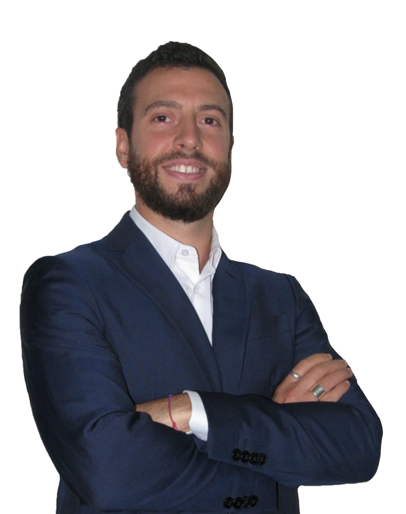

```{r, include=FALSE}
knitr::opts_chunk$set(
  results = 'asis', 
  echo = FALSE
)

library(magrittr) # For the pipe
source("R/cv_printing_functions.r")

if (params$lang == "en") {
  Sys.setlocale("LC_ALL", "en_US.UTF-8")
} else {
  Sys.setlocale("LC_ALL", "it_IT.UTF-8")
}

# Read in all data and initialize a CV printer object
cv <- create_cv_object(
  data_location = "https://docs.google.com/spreadsheets/d/1FwVp14baq9CeUS2x8nniXf9tBCBc3hJJxbbH3DDZziY/edit?usp=sharing", 
  resume = params$resume
  ) %>% 
  clean_cv_object(language = params$lang)
```

```{r}
# When in pdf export mode the little dots are unaligned, so fix that with some conditional CSS.
if (params$pdf_mode) {
    cat("
<style>
:root{
  --decorator-outer-offset-left: -6.5px;
}
</style>")
}
```


Main
================================================================================

::: aside

<center>
{width=80%}
</center>
  
&nbsp;  
  
```{r contacts}
if (params$lang == "en") {
  cat("#### Contacts {#contact}\n")
} else {
  cat("#### Contatti {#contact}\n")
}
cv %>% print_contacts()
```
  
&nbsp;  
  
```{r statistics}
if (params$lang == "en") {
  cat("#### Statistics\n")
} else {
  cat("#### Statistica\n")
}
cv %>% print_text_block("statistics_skills_aside")
```
  
&nbsp;  
  
```{r programming}
if (params$lang == "en") {
  cat("#### Programming\n")
} else {
  cat("#### Programmazione\n")
}
cv %>% print_skill_bars(section_ids = "programming")
```

&nbsp;  
  
```{r dataviz}
if (params$lang == "en") {
  cat("#### BI & Visualization\n")
} else {
  cat("#### BI & Visualization\n")
}
cv %>% print_skill_bars(section_ids = "dataviz")
```

:::

Marco Zanotti {#title}
--------------------------------------------------------------------------------

```{r}
cv %>% print_text_block("introduction") 
```

```{r professional_experience}
if (params$lang == "en") {
  cat("## Professional Experience {data-icon=suitcase}\n")
} else {
  cat("## Esperienza Professionale {data-icon=suitcase}\n")
}
cv %>% print_experience("professional_experience")
```

&nbsp;  

```{r teaching_experience}
if (params$lang == "en") {
  cat("## Teaching Experience {data-icon=chalkboard-teacher}\n")
} else {
  cat("## Insegnamento {data-icon=chalkboard-teacher}\n")
}
cv %>% print_experience("teaching_experience", n_top = 1)
```
  
  
  
\newpage  


::: aside

```{r database}
if (params$lang == "en") {
  cat("#### Databases\n")
} else {
  cat("#### Database\n")
}
cv %>% print_skill_bars(section_ids = "database")
```

&nbsp;

```{r versioning}
if (params$lang == "en") {
  cat("#### Versioning\n")
} else {
  cat("#### Versioning\n")
}
cv %>% print_skill_bars(section_ids = "versioning")
```

&nbsp;  

```{r ci_cd}
if (params$lang == "en") {
  cat("#### CI / CD\n")
} else {
  cat("#### CI / CD\n")
}
cv %>% print_skill_bars(section_ids = "integration")
```
  
&nbsp;  
  
```{r cloud}
if (params$lang == "en") {
  cat("#### Cloud\n")
} else {
  cat("#### Cloud\n")
}
cv %>% print_skill_bars(section_ids = "cloud")
```
    
&nbsp;  
  
```{r os}
if (params$lang == "en") {
  cat("#### Operating Systems\n")
} else {
  cat("#### Sistemi Operativi\n")
}
cv %>% print_skill_bars(section_ids = "os")
```

:::

```{r teaching_experience2}
# if (params$lang == "en") {
#   cat("## Teaching Experience {data-icon=chalkboard-teacher}\n")
# } else {
#   cat("## Insegnamento {data-icon=chalkboard-teacher}\n")
# }
cv %>% print_experience("teaching_experience", n_down = 2)
```
  
&nbsp;  

```{r publications}
if (params$lang == "en") {
  cat("## Publications {data-icon=book-open}\n")
} else {
  cat("## Pubblicazioni {data-icon=book-open}\n")
}
cv %>% print_experience("publication")
```

&nbsp;  

```{r education}
if (params$lang == "en") {
  cat("## Education {data-icon=graduation-cap}\n")
} else {
  cat("## Istruzione {data-icon=graduation-cap}\n")
}
cv %>% print_experience("education")
```


\newpage


::: aside

```{r languages}
if (params$lang == "en") {
  cat("#### Languages\n")
} else {
  cat("#### Lingue\n")
}
cv %>% print_skill_bars(section_ids = "language")
```

&nbsp;

&nbsp;

&nbsp;

```{r sports_hobbies}
if (params$lang == "en") {
  cat("#### Spoorts & Hobbies\n")
} else {
  cat("#### Sport e Hobby\n")
}
cv %>% print_text_block("sports_and_hobbies_aside")
```

&nbsp;  
  
&nbsp;  
  
&nbsp;  

&nbsp;  
  
&nbsp;  
  
&nbsp;  
  
&nbsp;  
  
&nbsp;  
    
&nbsp;  
  
&nbsp;  

&nbsp;  
  
&nbsp;  
  
&nbsp;  
  
&nbsp;  
  
&nbsp;  
    
&nbsp;  
  
&nbsp;  
  

```{r disclaimer}
if (params$lang == "en") {
  cat(
"Made with the R package [**pagedown**](https://github.com/rstudio/pagedown).  
  
*Last updated on *"
)
} else {
  cat(
"Creato con il pacchetto R [**pagedown**](https://github.com/rstudio/pagedown).  
  
*Aggiornato a *"
)
}
```
*`r stringr::str_to_title(format(Sys.time(), '%B %Y'))`*

:::

```{r certificates}
if (params$lang == "en") {
  cat("## Certificates {data-icon=award}\n")
} else {
  cat("## Certificazioni {data-icon=award}\n")
}
cv %>% print_experience("certification")
```

&nbsp;  

```{r personal_competences}
if (params$lang == "en") {
  cat("## Personal Competences {data-icon=user-cog}\n")
} else {
  cat("## Competenze Personali {data-icon=user-cog}\n")
}
cv %>% print_experience("personal_competence")
```
